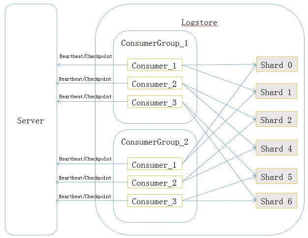
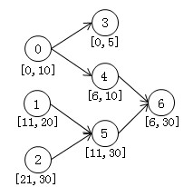
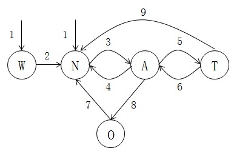

# Consumer Library

[中文版 README](https://github.com/aliyun/aliyun-log-consumer-java/blob/master/README.md)

## Use cases

Consumer Library is the high-level consumer mode for LogHub. It solves the problem of automatically allocating shards when multiple consumers consume the same Logstore. Typical scenarios include multi-consumer setups in Storm or Spark, where shard load balancing and consumer failover are handled automatically. Users only need to focus on their business logic without worrying about shard assignment, checkpoint management, or failover.

For example, suppose you do stream processing with Storm and start three consumer instances A, B, and C. Given a Logstore with 10 shards, the system automatically distributes them — 3 to A, 3 to B, and 4 to C.
* If instance A crashes, the 3 shards it was consuming are re-balanced to B and C. When A comes back, the system re-balances again.
* If you add instances D and E, the system rebalances so each instance consumes 2 shards.
* When shards are merged or split, the system rebalances according to the latest shard list.
* When a `read_only` shard is fully consumed, the remaining shards are re-balanced.

Throughout this process there is no data loss or duplication. In your code you only need to do three things:

1. Create a consumer group.
2. Register your instance name as an Instance and connect it to the consumer group.
3. Write the log-processing code.

**We strongly recommend using Consumer Library to consume data — you only have to care about how to process the data, not about complex concerns such as load balancing, checkpoint persistence, ordered consumption, or exception handling.**

## Concepts

Consumer Library has four main concepts: `consumer group`, `consumer`, `heartbeat`, and `checkpoint`. Their relationships are illustrated below:



* **consumer group**

    A sub-resource of a Logstore. Consumers that share the same consumer group name jointly consume all the data of the same Logstore without duplication. A Logstore can have at most 5 consumer groups, and names must be unique. Consumer groups under the same Logstore do not interfere with each other's consumption. A consumer group has two important attributes:
```
{
    "order":boolean,
    "timeout": integer
}
```
The `order` attribute indicates whether records sharing the same key are consumed in write-time order. `timeout` is the consumer timeout (in seconds): if a consumer's heartbeat interval exceeds `timeout`, it is considered timed out and the server treats it as offline.

* **consumer**

    Each consumer is assigned several shards. Its job is to consume the data on those shards. Consumer names must be unique within the same consumer group.

* **heartbeat**

    The consumer must periodically report a heartbeat packet to the server to indicate it is still alive.

* **checkpoint**

    The consumer periodically saves the position it has consumed for each assigned shard to the server. When the shard is later assigned to another consumer, that consumer can fetch the checkpoint from the server and resume from there.

## Implementation

### Communication protocol

The communication interface between consumers and the server is defined as follows:
```java
/*
    Create a consumer group. `inOrder` indicates whether records sharing the same key should be
    consumed in write-time order. `timeoutInSec` is the consumer heartbeat timeout — a consumer that
    has not heartbeated within `timeoutInSec` is treated as offline. A value around 20s is recommended.
*/
boolean CreateConsumerGroup(
        String project,
        String logstore,
        String consumerGroupName,
        boolean inOrder,
        int timeoutInSec);
/*
    Delete a consumer group.
*/
boolean DeleteConsumerGroup(
        String project,
        String logStore,
        String consumerGroup);
/*
    List all consumer groups under the Logstore, including the `order` and `timeout` attributes of each.
*/
List<ConsumerGroup> ListConsumerGroup(
            String project,
            String logStore);
/*
    Update the attributes of a consumer group. The name cannot be changed. If `inOrder` is updated
    from true to false, all shards that have not started being consumed are distributed across consumers.
    If `inOrder` is updated from false to true, it has no effect on shards that are already being consumed —
    because they are already in flight, ordering is moot for them. However, after the `inOrder` update,
    new shards produced by subsequent splits and merges will be consumed in order.
*/
boolean UpdateConsumerGroup(
            String project,
            String logStore,
            String consumerGroup,
            boolean inOrder,
            int timeoutInSec);
/*
    Update the checkpoint of a shard. Succeeds only if the shard is currently held by the given consumer.
*/
boolean UpdateCheckPoint(
            String project,
            String logStore,
            String consumerGroup,
            String consumer,
            int shard,
            String checkpoint);
/*
    Update the checkpoint of a shard. Always succeeds regardless of holder.
*/
boolean UpdateCheckPoint(
            String project,
            String logStore,
            String consumerGroup,
            int shard,
            String checkpoint);
/*
    Get the checkpoint of a shard under a consumer group.
*/
String GetCheckPoint(
            String project,
            String logStore,
            String consumerGroup,
            int shard);
/*
    Get the checkpoints of all shards under a consumer group. The result is a List of checkpoints — see SDK for details.
*/
List<ShardCheckPoint> GetCheckPoint(
            String project,
            String logStore,
            String consumerGroup);
/*
    Report the shards currently held by the consumer to the server. The server responds with an
    acknowledgement containing a set of shards. Let A be the shards the consumer claims to hold and
    B be the acknowledged set. (A - B) is the set of shards the consumer should give up — it should
    save their checkpoints to the server as soon as possible and stop consuming them. (B - A) is the
    set of shards the consumer can pick up — for each, it fetches the checkpoint from the server.
    In steady state the next heartbeat reports B. However, if the consumer is not yet willing (or able)
    to give up some shards in (A - B), it should re-report them in the next heartbeat as still held.

    Besides driving load balancing, heartbeats also tell the server the consumer is alive so that it
    is not removed from the consumer group. Once a heartbeat times out, the server removes the
    consumer from the group and re-distributes its shards to other consumers.
*/
List<Integer> HeartBeat(
            String project,
            String logStore,
            String consumerGroup,
            String consumer,
            ArrayList<Integer> shards);
```

### Finite state automaton

The server maintains a finite state automaton for each shard in a consumer group. There are five states: `already_alloc`, `not_alloc`, `wait`, `transfer`, `over`. Their meanings:

> **already_alloc**: the shard is held and consumed by some consumer.

> **not_alloc**: the shard is consumable but is not currently held by any consumer.

> **wait**: the shard cannot be consumed yet — its ancestor shards have not finished consumption.

> **transfer**: a transitional state used to hand the shard from one consumer to another. The current holder must give it up in a Heartbeat before the handover completes, hence the transitional state.

> **over**: all data of the shard has been consumed.

`wait` deserves further explanation. Suppose at some moment the relationships between shards look like this:



Initially there are 3 shards 0, 1, 2. The interval below each shard represents its hash-key range — for simplicity hash keys are shown as integers. At this moment a record with hash key 7 is written to shard 0. Then shard 0 is split into 3 and 4 — shard 0 enters `read_only`, shards 3 and 4 enter `read_write`. From now on records with hash key 7 are written to shard 4, not shard 0. Then shards 4 and 5 are merged into shard 6 — records with hash key 7 are now written to shard 6 only.

To consume records with hash key 7 in order, shard 4 must not be consumed before shard 0 is fully consumed. Likewise shard 6 must not be consumed before shard 4 is finished. We say shards 0 and 4 are **ancestors** of shard 6, and shard 6 is a **descendant** of shards 0 and 4. A shard can be consumed only when all its ancestor shards have been fully consumed. That is why the `wait` state exists.

The state transitions are illustrated as follows:



Each state is denoted by its initial in the diagram. The edges have the following meaning:

> 1: the initial state of a shard is either `wait` or `not_alloc`.

> 2: the shard's ancestor data has been fully consumed, so consumption of the current shard can begin.

> 3: the shard has been assigned to some consumer.

> 4: the consumer holding the shard has timed out — the shard is reclaimed.

> 5: the consumer holding the shard owns too many shards (violating the invariant that any two consumers' shard counts differ by at most 1), so the shard is transferred to a consumer that needs more shards. At this point the waiting consumer (the `next consumer`) is associated with the shard.

> 6: a Heartbeat from the current holder indicates it has given up the shard, and the shard is transferred to its associated `next consumer`. This transition can also occur if the `next consumer` times out, in which case the original holder continues to hold the shard.

> 7: when the checkpoint of an `over`-state shard is force-updated to a position other than the end of the shard, the shard returns to a consumable state. This kind of update must be used carefully — descendant shards may already have been consumed, which can break hash-key-ordered consumption.

> 8: a `read_only` shard has been fully consumed.

> 9: the consumer holding the shard times out and the shard is reclaimed to `not_alloc`.

A few notes:
* When a shard is in the `transfer` state, the server's Heartbeat ack to its current holder does **not** include it. The ack only includes shards that the consumer holds and are in `already_alloc`.
* When a consumer calls `UpdateCheckpoint`, if the shard is in `read_only` we check whether the checkpoint is at the end of the shard; if so the shard transitions to `over`.
* Transition 5 is the basis for the invariant that any two consumers' shard counts differ by at most 1. When a consumer is found to violate that condition, we revoke shards from over-loaded consumers and assign them to under-loaded consumers — this is what we call **consumption load balancing**. Shards being handed off go through the `transfer` state so the original holder, upon noticing the revocation, can persist their checkpoint to the server. The new consumer can then fetch the checkpoint from the server.
* When a new shard appears, it can only enter via transition 1. Its state is `wait` if it has ancestor shards that have not been fully consumed; otherwise `not_alloc`.
* Load balancing only considers shards in `not_alloc`, `already_alloc`, or `transfer`. Shards in `wait` or `over` do not qualify and are not assigned to any consumer.

## How to use Consumer Library

* Implement the two Consumer Library interfaces:
    * `ILogHubProcessor` — one instance per shard. Each instance consumes data from one specific shard.
    * `ILogHubProcessorFactory` — produces `ILogHubProcessor` instances.
* Fill in the configuration parameters.
* Start one or more client worker instances.

## Sample

### Main function

```
public static void main(String args[])
{
    LogHubConfig config = new LogHubConfig(...);

    ClientWorker worker = new ClientWorker(new SampleLogHubProcessorFactory(), config);

    Thread thread = new Thread(worker);
    // After the thread starts, the client worker runs automatically — ClientWorker implements Runnable.
    thread.start();
    // Call worker.shutdown() to exit the consumer instance; the associated thread stops automatically.
    worker.shutdown();
    // During its lifetime ClientWorker creates several asynchronous tasks. After shutdown, wait for the
    // in-flight tasks to exit safely — 30s is recommended.
    Thread.sleep(30 * 1000);
}

```
### `ILogHubProcessor` and `ILogHubProcessorFactory` sample
* The per-shard consumer instance. In practice the user focuses on the data-consumption logic. A single `ClientWorker` instance consumes data serially and creates only one `ILogHubProcessor` instance. When `ClientWorker` exits it calls the processor's `shutdown` method.
```
public class SampleLogHubProcessor implements ILogHubProcessor 
{
    private int mShardId;
    // Timestamp of the last checkpoint persistence
    private long mLastCheckTime = 0;

    public void initialize(int shardId)
    {
        mShardId = shardId;
    }

    // The main consumption logic
    public String process(List<LogGroupData> logGroups,
            ILogHubCheckPointTracker checkPointTracker)
    {
        for (LogGroupData group : logGroups)
        {
            List<LogItem> items = group.GetAllLogs();
            for (LogItem item : items)
            {
                // Print records of the log group
                System.out.println("shard_id:" + mShardId + " " + item.ToJsonString());
            }
        }
        long curTime = System.currentTimeMillis();
        // Persist the checkpoint to the server every 60 seconds. If the worker crashes within that
        // window, the next worker resumes from the previous checkpoint — some records may be replayed.
        if (curTime - mLastCheckTime >  60 * 1000)
        {
            try
            {
                checkPointTracker.saveCheckPoint(true);
            }
            catch (LogHubCheckPointException e)
            {
                e.printStackTrace();
            }
            mLastCheckTime = curTime;
        }
        else
        {
            try
            {
                checkPointTracker.saveCheckPoint(false);
            }
            catch (LogHubCheckPointException e)
            {
                e.printStackTrace();
            }
        }
        // Return null to indicate normal processing. To roll back to the last checkpoint and retry,
        // return `checkPointTracker.getCheckpoint()`.
        return null;
    }
    // Called when the worker exits — perform cleanup here.
    public void shutdown(ILogHubCheckPointTracker checkPointTracker)
    {
        // Persist the checkpoint to the server.
        try {
            checkPointTracker.saveCheckPoint(true);
        } catch (LogHubCheckPointException e) {
            e.printStackTrace();
        }
    }
}
```

* The factory that produces `ILogHubProcessor`:
```
public class SampleLogHubProcessorFactory implements ILogHubProcessorFactory 
{
    public ILogHubProcessor generatorProcessor()
    {   
        // Produce a consumer instance
        return new SampleLogHubProcessor();
    }
}
```
### Configuration

```
public class LogHubConfig 
{
    // Default polling interval for fetching data
    public static final long DEFAULT_DATA_FETCH_INTERVAL_MS = 200;
    // Consumer group name
    private String mConsumerGroupName;
    // Consumer name — must be unique within the consumer group
    private String mWorkerInstanceName;
    // LogHub endpoint
    private String mLogHubEndPoint;
    // Project name
    private String mProject;
    // Logstore name
    private String mLogStore;
    // AccessKey ID
    private String mAccessId;
    // AccessKey secret
    private String mAccessKey;
    // Starting position when the server has no recorded checkpoint for a shard.
    // One of BEGIN_CURSOR, END_CURSOR, SPECIAL_TIMER_CURSOR.
    private LogHubCursorPosition mCursorPosition;
    // When mCursorPosition is SPECIAL_TIMER_CURSOR, specifies the start time in seconds.
    private int  mLoghubCursorStartTime = 0;
    // Polling interval (ms) for fetching data — smaller = faster fetch. Default DEFAULT_DATA_FETCH_INTERVAL_MS.
    // Recommended >= 200ms.
    private long mDataFetchIntervalMillis;
    // Heartbeat interval to the server (ms). Recommended >= 10000ms.
    private long mHeartBeatIntervalMillis;
    // Whether to consume in order
    private boolean mConsumeInOrder;
    // SPL statement, e.g. *| where a = 'xxx'. See https://help.aliyun.com/zh/sls/user-guide/spl-overview
    private String query;
    // Whether request timeout is enabled
    private boolean requestTimeoutEnabled;
    // Request timeout
    private int requestTimeout;
}
```

### Maven dependency
```
<dependency>
    <groupId>com.aliyun.openservices</groupId>
    <artifactId>loghub-client-lib</artifactId>
    <version>0.6.46</version>
</dependency>
```

## FAQ and notes
* In `LogHubConfig`, `consumerGroupName` identifies the consumer group; consumers sharing the same `consumerGroupName` jointly consume the shards of the Logstore, and are distinguished by `workerInstance` name.
```
Suppose the Logstore has shards 0..3.
Three workers with the following (consumerGroupName, workerInstanceName) pairs:
<consumer_group_name_1 , worker_A>
<consumer_group_name_1 , worker_B>
<consumer_group_name_2 , worker_C>
Then the shard assignment is:
<consumer_group_name_1 , worker_A>: shard_0, shard_1
<consumer_group_name_1 , worker_B>: shard_2, shard_3
<consumer_group_name_2 , worker_C>: shard_0, shard_1, shard_2, shard_3  # different group names do not affect each other
```
* Ensure your `ILogHubProcessor.process()` implementation always finishes and returns — this is important.
* `ILogHubCheckPointTracker.saveCheckPoint()`: whether the parameter is true or false, it indicates that the current batch is fully processed. `true` persists to the server immediately; `false` is synced to the server every 60 seconds.
* The AccessKey configured in `LogHubConfig` belongs to a sub-account. The following RAM authorizations are required — see the [API documentation](https://help.aliyun.com/document_detail/sls/api/ram/overview.html?spm=5176.docsls/api/ram/resources.6.136.0FbVOy) for details:

|Action|Resource|
|--------------|--------------|
|log:GetCursorOrData|acs:log:**${regionName}**:**${projectOwnerAliUid}**:project/**${projectName}**/logstore/**${logstoreName}**|
|log:CreateConsumerGroup|acs:log:**${regionName}**:**${projectOwnerAliUid}**:project/**${projectName}**/logstore/**${logstoreName}**/consumergroup/*|
|log:ListConsumerGroup|acs:log:**${regionName}**:**${projectOwnerAliUid}**:project/**${projectName}**/logstore/**${logstoreName}**/consumergroup/*|
|log:ConsumerGroupUpdateCheckPoint|acs:log:**${regionName}**:**${projectOwnerAliUid}**:project/**${projectName}**/logstore/**${logstoreName}**/consumergroup/**${consumerGroupName}**|
|log:ConsumerGroupHeartBeat|acs:log:**${regionName}**:**${projectOwnerAliUid}**:project/**${projectName}**/logstore/**${logstoreName}**/consumergroup/**${consumerGroupName}**|
|log:GetConsumerGroupCheckPoint|acs:log:**${regionName}**:**${projectOwnerAliUid}**:project/**${projectName}**/logstore/**${logstoreName}**/consumergroup/**${consumerGroupName}**|
